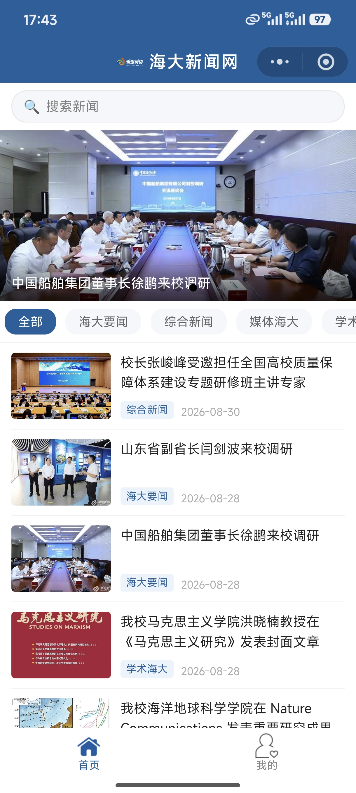
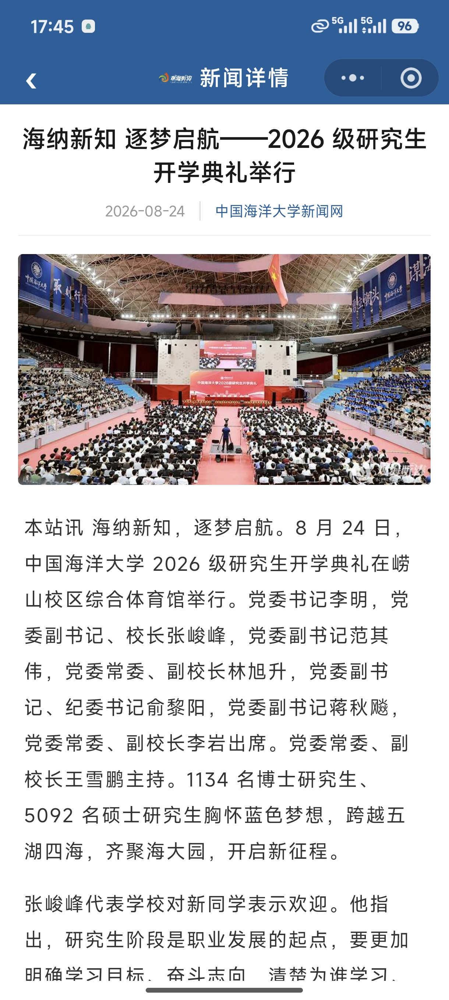
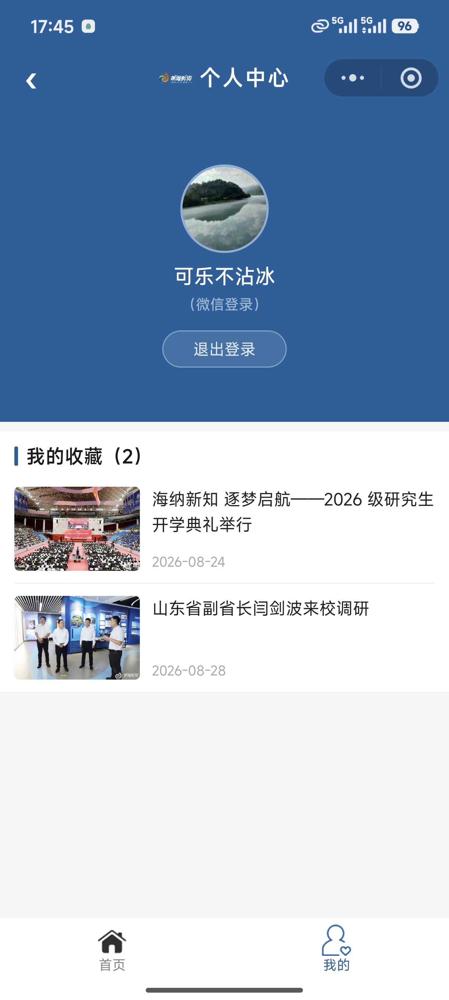

<center>姓名：贺凡思杰  学号：24020007043</center>

| 姓名和学号？         | 贺凡思杰，24020007043     |
| -------------------- | -------------------------------- |
| 本实验属于哪门课程？ | 中国海洋大学26夏《移动软件开发》 |
| 实验名称？           | 实验3：高校新闻网              |
| 博客地址？           | https://commings-jie.github.io/ |
| Github仓库地址？     | https://github.com/Commings-Jie/weixin-xiaochengxu |

## 一、实验内容

### 1.1 实验环境准备

- **操作系统**：Windows 11
- **开发工具**：微信开发者工具 Stable 2.02.2608040
- **渲染模式**：glass-easel 组件框架

### 1.2 实验任务

模仿网易新闻实现一个基于模拟数据的海大主题新闻小程序，包含首页、新闻详情页和个人中心三个页面，实现新闻浏览、收藏、用户登录等功能。

### 1.3 小程序实现

#### 1.3.1 项目文件结构

```
实验三/
── app.js                      # 小程序入口逻辑
── app.json                    # 全局配置（页面路由、导航栏、tabBar）
├── app.wxss                    # 全局样式（新闻列表公共样式）
├── images/
│   ├── index.png               # 首页图标（未选中）
│   ├── index_blue.png          # 首页图标（选中）
│   ├── my.png                  # 我的图标（未选中）
│   ├── my_blue.png             # 我的图标（选中）
│   ├── logo.png                # 海大校徽
│   └── news*.jpg               # 新闻图片（13张）
├── components/
│   ── navbar/                 # 自定义导航栏组件
│       ├── navbar.js
│       ├── navbar.json
│       ├── navbar.wxml
│       └── navbar.wxss
├── pages/
│   ├── index/                  # 首页
│   │   ├── index.js            # 首页逻辑（轮播图、分类筛选、搜索）
│   │   ├── index.json
│   │   ├── index.wxml          # 首页模板（搜索栏、轮播图、分类栏、新闻列表）
│   │   └── index.wxss
│   ├── detail/                 # 新闻详情页
│   │   ├── detail.js           # 详情页逻辑（新闻加载、收藏功能）
│   │   ├── detail.json
│   │   ├── detail.wxml         # 详情页模板（标题、海报、正文、作者信息）
│   │   └── detail.wxss
│   └── my/                     # 个人中心页
│       ├── my.js               # 个人中心逻辑（登录、收藏列表）
│       ├── my.json
│       ├── my.wxml             # 个人中心模板（登录区、收藏列表）
│       └── my.wxss
── utils/
│   └── common.js               # 工具函数（新闻数据、分类数据）
├── project.config.json
└── sitemap.json
```

#### 1.3.2 核心代码

**全局配置（app.json）：**

```json
{
  "pages": [
    "pages/index/index",
    "pages/detail/detail",
    "pages/my/my"
  ],
  "window": {
    "navigationStyle": "custom",
    "navigationBarTextStyle": "white",
    "backgroundColor": "#f4f6f8"
  },
  "tabBar": {
    "color": "#888888",
    "selectedColor": "#1a5f9e",
    "backgroundColor": "#ffffff",
    "borderStyle": "white",
    "list": [
      {
        "pagePath": "pages/index/index",
        "text": "首页",
        "iconPath": "images/index.png",
        "selectedIconPath": "images/index_blue.png"
      },
      {
        "pagePath": "pages/my/my",
        "text": "我的",
        "iconPath": "images/my.png",
        "selectedIconPath": "images/my_blue.png"
      }
    ]
  },
  "style": "v2",
  "componentFramework": "glass-easel",
  "sitemapLocation": "sitemap.json",
  "lazyCodeLoading": "requiredComponents"
}
```

**工具函数（utils/common.js）：**

```javascript
//模拟新闻数据
const news = [
  {id: '122579',
  category: '海大要闻',
  title: '山东省副省长闫剑波来校调研',
  poster: '/images/news122579.jpg',
  author: '袁艺',
  editor: '赵奚赟',
  responsible_editor: '李华昌',
  content: '本站讯 8月27日，山东省人民政府副省长、党组成员闫剑波来校调研。学校党委书记李明陪同调研。\n\n闫剑波一行参观了学校校史馆、海洋科技成果展和海洋工程技术与装备展...',
  add_date: '2026-08-28'},
  // ... 共13条新闻
];

//分类列表
const categories = ['全部', '海大要闻', '综合新闻', '媒体海大', '学术海大'];

//获取新闻列表（支持分类筛选，按时间倒序）
function getNewsList(category) {
  let list = [];
  for (var i = 0; i < news.length; i++) {
    if (!category || category === '全部' || news[i].category === category) {
      let obj = {};
      obj.id = news[i].id;
      obj.poster = news[i].poster;
      obj.add_date = news[i].add_date;
      obj.title = news[i].title;
      obj.category = news[i].category;
      list.push(obj);
    }
  }
  // 按日期倒序排序（最新的在前）
  list.sort(function(a, b) {
    return b.add_date.localeCompare(a.add_date);
  });
  return list;
}

//获取轮播图新闻（按时间排序后取最新的3条）
function getSwiperNews() {
  let list = [];
  let sorted = news.slice().sort(function(a, b) {
    return b.add_date.localeCompare(a.add_date);
  });
  let count = Math.min(3, sorted.length);
  for (var i = 0; i < count; i++) {
    list.push({
      id: sorted[i].id,
      src: sorted[i].poster,
      title: sorted[i].title
    });
  }
  return list;
}

//获取新闻内容
function getNewsDetail(newsID) {
  let msg = { code: '404', news: {} };
  for (var i = 0; i < news.length; i++) {
    if (newsID == news[i].id) {
      msg.code = '200';
      msg.news = news[i];
      break;
    }
  }
  return msg;
}

module.exports = {
  getNewsList: getNewsList,
  getSwiperNews: getSwiperNews,
  getNewsDetail: getNewsDetail,
  getCategories: function() { return categories; }
}
```

**首页模板（pages/index/index.wxml）：**

```html
<navbar title="海大新闻网"></navbar>

<!-- 搜索栏 -->
<view class="search-bar">
  <view class="search-box">
    <text class="search-icon">🔍</text>
    <input class="search-input" placeholder="搜索新闻" confirm-type="search" 
           bindinput="onSearchInput" bindconfirm="onSearch" value="{{searchKeyword}}"/>
    <text class="search-clear" wx:if="{{searchKeyword}}" bindtap="clearSearch">✕</text>
  </view>
</view>

<!-- 幻灯片 -->
<swiper indicator-dots="true" autoplay="true" interval="4000" duration="500" circular="true">
  <view wx:for="{{swiperList}}" wx:key="id">
    <swiper-item bindtap="goToSwiperDetail" data-id="{{item.id}}">
      <image src="{{item.src}}" mode="aspectFill"></image>
      <view class="swiper-title-bar">
        <text class="swiper-title-text">{{item.title}}</text>
      </view>
    </swiper-item>
  </view>
</swiper>

<!-- 分类标签栏 -->
<scroll-view class="category-bar" scroll-x="true">
  <view class="category-item {{currentCategory === item ? 'active' : ''}}" 
        wx:for="{{categories}}" wx:key="*this"
        bindtap="switchCategory" data-category="{{item}}">
    {{item}}
  </view>
</scroll-view>

<!-- 新闻列表 -->
<view class="news-list">
  <view class="news-item" wx:for="{{newsList}}" wx:key="{{item.id}}">
    <image src="{{item.poster}}" mode="aspectFill" bindtap="goToDetail" data-id="{{item.id}}"></image>
    <view class="news-info" bindtap="goToDetail" data-id="{{item.id}}">
      <text class="news-title">{{item.title}}</text>
      <view class="news-meta">
        <text class="news-category">{{item.category}}</text>
        <text class="news-date">{{item.add_date}}</text>
      </view>
    </view>
  </view>
</view>
```

**首页逻辑（pages/index/index.js）：**

```javascript
var common = require('../../utils/common.js')

Page({
  data: {
    swiperList: [],
    categories: [],
    currentCategory: '全部',
    newsList: [],
    allNewsList: [],
    searchKeyword: '',
    isSearching: false
  },

  onLoad: function (options) {
    let categories = common.getCategories()
    let newsList = common.getNewsList()
    this.setData({
      categories: categories,
      newsList: newsList,
      allNewsList: newsList
    })
    this.refreshSwiper()
  },

  onShow: function() {},

  refreshSwiper: function() {
    let swiperList = common.getSwiperNews()
    this.setData({ swiperList: swiperList })
  },

  onSearchInput: function(e) {
    let keyword = e.detail.value
    this.setData({ searchKeyword: keyword })
    let trimmedKeyword = keyword.trim()
    if (trimmedKeyword) {
      this.searchNews(trimmedKeyword)
    } else {
      this.clearSearch()
    }
  },

  searchNews: function(keyword) {
    let filtered = this.data.allNewsList.filter(item => {
      return item.title.indexOf(keyword) !== -1
    })
    this.setData({ newsList: filtered, isSearching: true })
  },

  clearSearch: function() {
    let newsList = common.getNewsList(this.data.currentCategory)
    this.setData({ searchKeyword: '', isSearching: false, newsList: newsList })
  },

  goToSwiperDetail: function(e) {
    let id = e.currentTarget.dataset.id
    wx.navigateTo({ url: '../detail/detail?id=' + id })
  },

  switchCategory: function(e) {
    let category = e.currentTarget.dataset.category
    let newsList = common.getNewsList(category)
    this.setData({
      currentCategory: category,
      newsList: newsList,
      allNewsList: newsList,
      searchKeyword: '',
      isSearching: false
    })
  },

  goToDetail: function (e) {
    let id = e.currentTarget.dataset.id
    wx.navigateTo({ url: '../detail/detail?id=' + id })
  }
})
```

**新闻详情页模板（pages/detail/detail.wxml）：**

```html
<navbar title="新闻详情" showBack="{{true}}"></navbar>

<view class="container">
  <view class="title">{{article.title}}</view>

  <view class="meta">
    <text class="meta-date">{{article.add_date}}</text>
    <text class="meta-source">中国海洋大学新闻网</text>
  </view>

  <view class="poster">
    <image src="{{article.poster}}" mode="widthFix"></image>
  </view>

  <view class="content">
    <view class="paragraph" wx:for="{{paragraphs}}" wx:key="index">
      <text>{{item}}</text>
    </view>
  </view>

  <view class="article-info" wx:if="{{article.author || article.editor || article.responsible_editor}}">
    <view class="info-row" wx:if="{{article.author}}">
      <text class="info-label">文/图：</text>
      <text class="info-value">{{article.author}}</text>
    </view>
    <view class="info-row" wx:if="{{article.editor}}">
      <text class="info-label">编辑：</text>
      <text class="info-value">{{article.editor}}</text>
    </view>
    <view class="info-row" wx:if="{{article.responsible_editor}}">
      <text class="info-label">责任编辑：</text>
      <text class="info-value">{{article.responsible_editor}}</text>
    </view>
  </view>

  <view class="divider"></view>

  <view class="fav-btn-wrap">
    <button wx:if="{{isAdd}}" class="fav-btn fav-active" bindtap="cancelFavorites">❤️ 已收藏</button>
    <button wx:else class="fav-btn" bindtap="addFavorites">❤️ 收藏本文</button>
  </view>
</view>
```

**新闻详情页逻辑（pages/detail/detail.js）：**

```javascript
var common = require('../../utils/common.js')

Page({
  data: {
    article: {},
    isAdd: false,
    paragraphs: []
  },

  onLoad: function (options) {
    let id = options.id
    var newarticle = wx.getStorageSync(id)

    if (newarticle != '') {
      this.setData({
        isAdd: true,
        article: newarticle,
        paragraphs: this.splitContent(newarticle.content)
      })
    } else {
      let result = common.getNewsDetail(id)
      if (result.code == '200') {
        this.setData({
          article: result.news,
          isAdd: false,
          paragraphs: this.splitContent(result.news.content)
        })
      }
    }

    const app = getApp()
    if (!app.globalData.isLogin) {
      this.setData({ isAdd: false })
    }
  },

  onShow: function () {
    const app = getApp()
    if (!app.globalData.isLogin) {
      this.setData({ isAdd: false })
    }
  },

  splitContent: function(content) {
    if (!content) return []
    let paragraphs = content.split('\n\n')
    return paragraphs.filter(p => p.trim()).map(p => p.trim())
  },

  addFavorites: function () {
    const app = getApp()
    if (!app.globalData.isLogin) {
      wx.showModal({
        title: '提示',
        content: '请先登录后再收藏',
        confirmText: '去登录',
        confirmColor: '#1a5f9e',
        success: (res) => {
          if (res.confirm) {
            wx.switchTab({ url: '../my/my' })
          }
        }
      })
      return
    }

    let article = this.data.article
    wx.setStorageSync(article.id, article)
    this.setData({ isAdd: true })
    wx.showToast({ title: '收藏成功', icon: 'success' })
  },

  cancelFavorites: function () {
    let article = this.data.article
    wx.removeStorageSync(article.id)
    this.setData({ isAdd: false })
  }
})
```

**个人中心页模板（pages/my/my.wxml）：**

```html
<navbar title="个人中心" showHome="{{true}}"></navbar>

<view class="myLogin">
  <block wx:if="{{isLogin}}">
    <image class="user-avatar" src="{{src}}"></image>
    <text class="nickname">{{nickName}}</text>
    <text class="login-type">（{{loginType}}登录）</text>
    <view class="logout-btn" bindtap="logout">退出登录</view>
  </block>
  <view wx:else class="login-area">
    <view class="avatar-placeholder">
      <text class="avatar-emoji">👤</text>
    </view>
    <view class="login-hint">登录后享受收藏功能</view>
    <view class="login-buttons">
      <button class="login-btn wx-login-btn" bindtap="goWxLogin">
        <text class="btn-emoji">💬</text>
        <text class="btn-text">微信账号登录</text>
      </button>
    </view>
  </view>
</view>

<view class="wx-profile-page" wx:if="{{showWxProfile}}">
  <view class="profile-header">
    <text class="profile-title">完善个人信息</text>
  </view>
  <view class="profile-form">
    <view class="profile-item">
      <text class="profile-label">头像</text>
      <button class="avatar-btn" open-type="chooseAvatar" bindchooseavatar="onChooseAvatar">
        <image class="avatar-preview" wx:if="{{tempAvatar}}" src="{{tempAvatar}}"></image>
        <view class="avatar-select-placeholder" wx:else>
          <text class="camera-emoji">📷</text>
        </view>
        <text class="avatar-tip">点击选择头像</text>
      </button>
    </view>
    <view class="profile-item">
      <text class="profile-label">昵称</text>
      <input class="nickname-input" type="nickname" placeholder="请输入昵称" 
             bindinput="onNicknameInput" bindblur="onNicknameInput" value="{{tempNickName}}"/>
    </view>
  </view>
  <view class="profile-footer">
    <button class="profile-cancel" bindtap="cancelWxProfile">取消</button>
    <button class="profile-confirm" bindtap="confirmWxProfile">确认登录</button>
  </view>
</view>

<view class="myFavorite">
  <view class="section-header">
    <view class="bar"></view>
    <text class="section-title">我的收藏（{{number}}）</text>
  </view>

  <view class="news-list" wx:if="{{newsList.length > 0}}">
    <view class="news-item" wx:for="{{newsList}}" wx:key="{{item.id}}" 
          bindtap="goToDetail" data-id="{{item.id}}">
      <image src="{{item.poster}}" mode="aspectFill"></image>
      <view class="news-info">
        <text class="news-title">{{item.title}}</text>
        <text class="news-date">{{item.add_date}}</text>
      </view>
    </view>
  </view>

  <view class="empty-tip" wx:else>
    <view class="empty-icon">📭</view>
    <text class="empty-text">暂无收藏内容</text>
    <text class="empty-sub">浏览新闻时点击收藏即可添加</text>
  </view>
</view>
```

**个人中心页逻辑（pages/my/my.js）：**

```javascript
Page({
  data: {
    isLogin: false,
    src: '',
    nickName: '',
    loginType: '',
    number: 0,
    newsList: [],
    showWxProfile: false,
    tempAvatar: '',
    tempNickName: ''
  },

  goWxLogin() {
    this.setData({ showWxProfile: true, tempAvatar: '', tempNickName: '' })
  },

  onChooseAvatar(e) {
    this.setData({ tempAvatar: e.detail.avatarUrl })
  },

  onNicknameInput(e) {
    this.setData({ tempNickName: e.detail.value })
  },

  cancelWxProfile() {
    this.setData({ showWxProfile: false })
  },

  confirmWxProfile() {
    let avatar = this.data.tempAvatar
    let nickname = this.data.tempNickName

    if (!avatar) {
      wx.showToast({ title: '请选择头像', icon: 'none' })
      return
    }
    if (!nickname) {
      wx.showToast({ title: '请输入昵称', icon: 'none' })
      return
    }

    this.setData({
      isLogin: true,
      src: avatar,
      nickName: nickname,
      loginType: '微信',
      showWxProfile: false
    })

    const app = getApp()
    app.globalData.isLogin = true

    wx.showToast({ title: '登录成功', icon: 'success' })
    this.getMyFavorites()
  },

  logout() {
    wx.showModal({
      title: '提示',
      content: '确定要退出登录吗？',
      confirmColor: '#1a5f9e',
      success: (res) => {
        if (res.confirm) {
          this.setData({
            isLogin: false,
            src: '',
            nickName: '',
            loginType: '',
            number: 0,
            newsList: []
          })
          const app = getApp()
          app.globalData.isLogin = false
          wx.showToast({ title: '已退出登录', icon: 'success' })
        }
      }
    })
  },

  getMyFavorites: function () {
    let info = wx.getStorageInfoSync()
    let keys = info.keys

    let myList = []
    for (var i = 0; i < keys.length; i++) {
      let obj = wx.getStorageSync(keys[i])
      if (obj && obj.id && obj.title) {
        myList.push(obj)
      }
    }

    this.setData({ newsList: myList, number: myList.length })
  },

  goToDetail: function (e) {
    let id = e.currentTarget.dataset.id
    wx.navigateTo({ url: '../detail/detail?id=' + id })
  },

  onShow: function () {
    if (this.data.isLogin) {
      this.getMyFavorites()
    }
  }
})
```

#### 1.3.3 功能说明

| 功能 | 实现方式 |
|------|---------|
| 首页轮播图 | `<swiper>` 组件，`autoplay`、`circular`、`indicator-dots`，显示最新3条新闻 |
| 新闻分类筛选 | 分类标签栏，点击切换分类，调用 `common.getNewsList(category)` |
| 新闻搜索 | 搜索框实时搜索，`bindinput` 事件，按标题关键词过滤 |
| 新闻列表 | `wx:for` 循环渲染，左图右文布局，显示分类标签和日期 |
| 新闻详情 | 标题居中、元信息、海报图、分段正文、作者信息、收藏按钮 |
| 收藏功能 | `wx.setStorageSync` / `wx.removeStorageSync` 本地存储 |
| 用户登录 | `open-type="chooseAvatar"` 选择头像，`type="nickname"` 输入昵称 |
| 退出登录 | 确认对话框，清除用户信息和收藏列表 |
| tabBar切换 | 首页和我的两个tab，图标切换 |
| 自定义导航栏 | navbar组件，支持返回按钮和首页按钮 |

#### 1.3.4 运行效果







### 1.4 关键技术点

1. **数据驱动视图**：通过 `setData()` 更新数据，视图自动响应变化
2. **本地存储**：使用 `wx.setStorageSync` / `wx.getStorageSync` 实现收藏功能
3. **组件化开发**：自定义 navbar 组件，支持返回和首页跳转
4. **Flex布局**：大量使用 Flex 实现响应式排版
5. **事件处理**：`bindtap`、`bindinput`、`bindchooseavatar` 等事件绑定
6. **条件渲染**：`wx:if` / `wx:else` 控制登录状态、收藏状态显示
7. **列表渲染**：`wx:for` 循环渲染新闻列表、分类标签

## 二、问题总结与体会

### 2.1 遇到的问题及解决方案

**问题1：图标文字居中问题**

- **现象**：收藏按钮、登录按钮中的图标和文字没有垂直居中，显示偏下
- **原因**：使用 `line-height` 实现垂直居中时，emoji 图标和文字的行高不一致，导致对齐问题
- **解决**：
  1. 移除 `line-height` 属性
  2. 改用 Flex 布局：`display: flex` + `align-items: center` + `justify-content: center`
  3. 添加 `padding: 0` 和 `margin: 0` 清除按钮默认间距
  4. 添加 `::after { display: none; }` 清除小程序按钮的默认伪元素

```css
.fav-btn {
  display: flex;
  align-items: center;
  justify-content: center;
  padding: 0;
  margin: 0;
}

.fav-btn::after {
  display: none;
}
```

**问题2：收藏页只能点击文字跳转**

- **现象**：在个人中心的收藏列表中，只能点击新闻标题文字才能跳转到详情页，点击图片和空白区域无效
- **原因**：点击事件 `bindtap` 绑定在 `<text class="news-title">` 上，只有点击文字区域才触发
- **解决**：将点击事件从 `<text>` 移到外层的 `<view class="news-item">` 上，这样整个新闻条目（包括图片、文字、空白区域）都可以点击跳转

```html
<!-- 修改前 -->
<view class="news-item">
  <image src="{{item.poster}}"></image>
  <view class="news-info">
    <text class="news-title" bindtap="goToDetail" data-id="{{item.id}}">{{item.title}}</text>
  </view>
</view>

<!-- 修改后 -->
<view class="news-item" bindtap="goToDetail" data-id="{{item.id}}">
  <image src="{{item.poster}}"></image>
  <view class="news-info">
    <text class="news-title">{{item.title}}</text>
  </view>
</view>
```

**问题3：搜索框不能输入空格**

- **现象**：在搜索框中输入空格时，空格会被自动删除，无法正常输入包含空格的关键词
- **原因**：在 `onSearchInput` 方法中，使用 `e.detail.value.trim()` 立即去除了首尾空格，然后 `setData` 更新搜索框内容，导致用户输入的空格被清除
- **解决**：
  1. 保留用户输入的原始内容（包括空格）用于显示
  2. 搜索时使用 `trim()` 后的关键词进行匹配
  3. 这样既允许用户输入空格，又避免搜索纯空格

```javascript
onSearchInput: function(e) {
  let keyword = e.detail.value  // 保留原始输入
  this.setData({ searchKeyword: keyword })
  
  let trimmedKeyword = keyword.trim()  // 搜索时使用trim后的值
  if (trimmedKeyword) {
    this.searchNews(trimmedKeyword)
  } else {
    this.clearSearch()
  }
}
```

**问题4：手机预览图片不显示**

- **现象**：在开发者工具中图片正常显示，但手机预览时所有图片都无法加载
- **原因**：微信小程序默认只允许 HTTPS 协议或本地图片，海大新闻网的图片都是 HTTP 开头，手机真机会被拦截
- **解决**：
  1. 将所有新闻图片下载到本地 `images/` 目录
  2. 修改 `common.js` 中的 `poster` 字段，从 HTTP 链接改为本地路径 `/images/newsXXXXX.jpg`
  3. 使用 Python Pillow 库压缩图片，将总大小从 5.5MB 压缩到 823KB（压缩率85%）

```python
from PIL import Image
img = Image.open('news122579.jpg')
img = img.resize((800, int(img.height * 800 / img.width)), Image.LANCZOS)
img.save('news122579.jpg', 'JPEG', quality=55, optimize=True)
```

**问题5：轮播图标题超出屏幕**

- **现象**：轮播图底部的新闻标题文字过长时，会超出屏幕右侧边界
- **原因**：标题栏的 `padding` 没有设置 `box-sizing: border-box`，导致实际宽度超出容器
- **解决**：
  1. 给 `.swiper-title-bar` 添加 `box-sizing: border-box`
  2. 给 `.swiper-title-text` 添加 `max-width: 100%` 和 `display: block`
  3. 保持 `overflow: hidden` + `text-overflow: ellipsis` + `white-space: nowrap` 实现省略号效果

```css
.swiper-title-bar {
  box-sizing: border-box;
}

.swiper-title-text {
  max-width: 100%;
  display: block;
}
```

### 2.2 收获与体会

1. **掌握了小程序的完整开发流程**：从项目创建、页面设计、样式编写到功能实现，对小程序开发有了更系统的认识

2. **学会了组件化开发**：通过自定义 navbar 组件，理解了组件的 properties、data、methods 的使用，以及组件的复用

3. **熟悉了微信 API 的使用**：通过实现收藏功能，掌握了 `wx.setStorageSync` / `wx.getStorageSync` 等本地存储 API；通过登录功能，掌握了 `open-type="chooseAvatar"` 和 `type="nickname"` 的使用

4. **提升了问题调试能力**：在开发过程中遇到了图标居中、点击区域、搜索空格、图片加载等多个问题，通过查阅文档、调试代码，逐步解决了这些问题

5. **体会到了细节的重要性**：UI 开发中，一个小的样式问题（如按钮居中）可能影响整体用户体验，需要不断打磨和优化

6. **学会了性能优化**：通过图片压缩，将小程序包体积从 5.5MB 优化到 823KB，确保了手机预览和上传的顺利进行

7. **理解了数据驱动视图的思想**：通过 `setData()` 更新数据，视图自动响应变化，这种模式让开发更加高效和可维护
