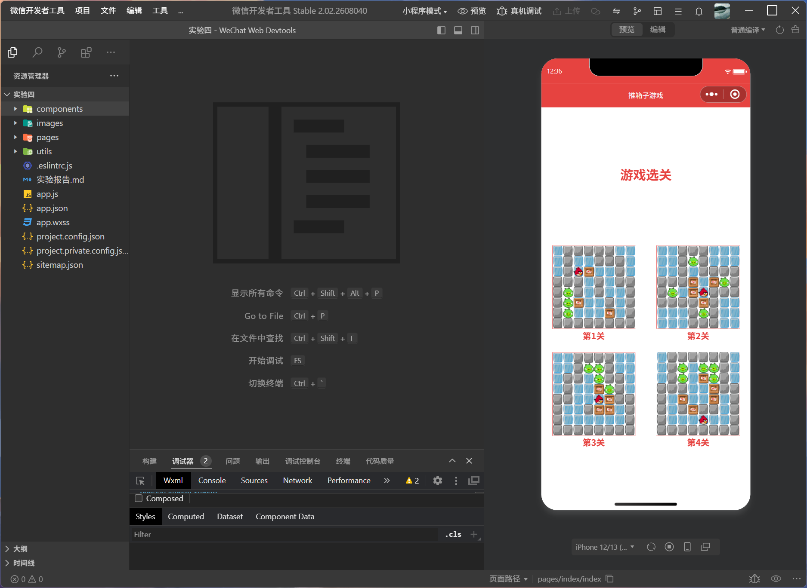
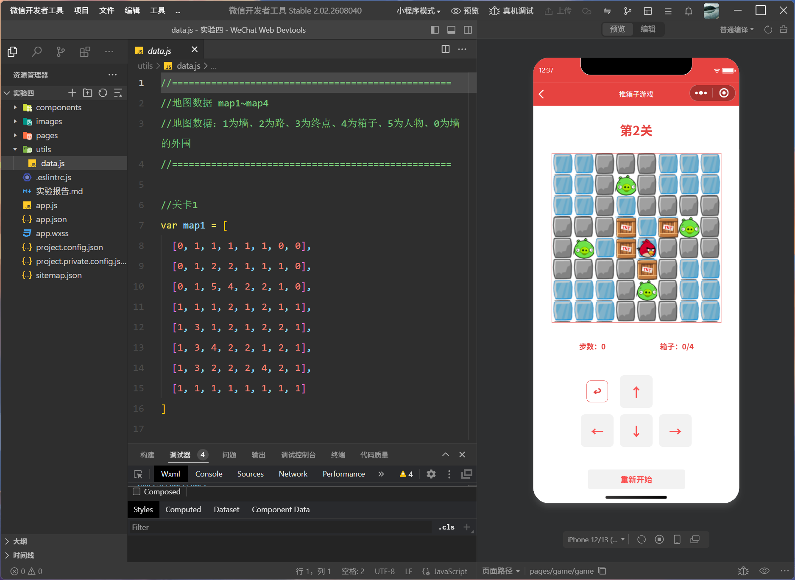
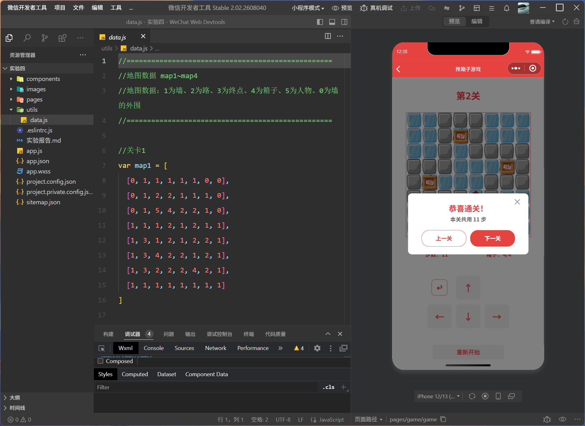

<center>姓名：贺凡思杰  学号：24020007043</center>

| 姓名和学号？         | 贺凡思杰，24020007043     |
| -------------------- | -------------------------------- |
| 本实验属于哪门课程？ | 中国海洋大学26夏《移动软件开发》 |
| 实验名称？           | 实验4：推箱子游戏              |
| 博客地址？           | https://commings-jie.github.io/ |
| Github仓库地址？     | https://github.com/Commings-Jie/weixin-xiaochengxu |

## 一、实验内容

### 1.1 实验环境准备

- **操作系统**：Windows 11
- **开发工具**：微信开发者工具 Stable 2.02.2608040
- **渲染模式**：glass-easel 组件框架

### 1.2 实验任务

综合应用 `<canvas>` 组件和小程序绘图 API，制作一个推箱子小游戏。实现关卡选择、游戏画面绘制、方向键控制角色移动、推箱子、胜负判断、步数统计、回退撤销、重新开始等功能。

### 1.3 小程序实现

#### 1.3.1 项目文件结构

```
实验四/
├── app.js                      # 小程序入口逻辑
├── app.json                    # 全局配置（页面路由、导航栏红色主题）
├── app.wxss                    # 全局样式（容器、标题公共样式）
── images/
│   ├── level01.png             # 第1关预览图
│   ├── level02.png             # 第2关预览图
│   ├── level03.png             # 第3关预览图
│   ├── level04.png             # 第4关预览图
│   └── icons/
│       ├── bird.png            # 游戏主角（小鸟）图标
│       ├── box.png             # 箱子图标
│       ├── ice.png             # 道路/冰面图标
│       ├── pig.png             # 终点（小猪）图标
│       └── stone.png           # 墙/石头图标
├── pages/
│   ├── index/                  # 首页（关卡选择）
│   │   ├── index.js            # 关卡列表数据、选关跳转逻辑
│   │   ├── index.json
│   │   ├── index.wxml          # 标题 + 4个关卡缩略图（2×2布局）
│   │   └── index.wxss
│   └── game/                   # 游戏页
│       ├── game.js             # 完整游戏逻辑（地图初始化、绘制、移动、推箱、胜负判断、回退）
│       ├── game.json
│       ├── game.wxml           # 关卡标题、canvas画布、统计信息、方向键、通关弹窗
│       └── game.wxss
├── utils/
│   ── data.js                 # 公共数据（4个关卡的8×8地图二维数组）
├── project.config.json
└── sitemap.json
```

#### 1.3.2 核心代码

**全局配置（app.json）：**

```json
{
  "pages": [
    "pages/index/index",
    "pages/game/game"
  ],
  "window": {
    "navigationBarBackgroundColor": "#E64340",
    "navigationBarTitleText": "推箱子游戏",
    "navigationBarTextStyle": "white"
  },
  "style": "v2",
  "sitemapLocation": "sitemap.json"
}
```

**公共地图数据（utils/data.js）：**

```javascript
//==================================================
//地图数据 map1~map4
//地图数据：1为墙、2为路、3为终点、4为箱子、5为人物、0为墙的外围
//==================================================

//关卡1
var map1 = [
  [0, 1, 1, 1, 1, 1, 0, 0],
  [0, 1, 2, 2, 1, 1, 1, 0],
  [0, 1, 5, 4, 2, 2, 1, 0],
  [1, 1, 1, 2, 1, 2, 1, 1],
  [1, 3, 1, 2, 1, 2, 2, 1],
  [1, 3, 4, 2, 2, 1, 2, 1],
  [1, 3, 2, 2, 2, 4, 2, 1],
  [1, 1, 1, 1, 1, 1, 1, 1]
]

//关卡2
var map2 = [
  [0, 0, 1, 1, 1, 0, 0, 0],
  [0, 0, 1, 3, 1, 0, 0, 0],
  [0, 0, 1, 2, 1, 1, 1, 1],
  [1, 1, 1, 4, 2, 4, 3, 1],
  [1, 3, 2, 4, 5, 1, 1, 1],
  [1, 1, 1, 1, 4, 1, 0, 0],
  [0, 0, 0, 1, 3, 1, 0, 0],
  [0, 0, 0, 1, 1, 1, 0, 0]
]

//关卡3
var map3 = [
  [0, 0, 1, 1, 1, 1, 0, 0],
  [0, 0, 1, 3, 3, 1, 0, 0],
  [0, 1, 1, 2, 3, 1, 1, 0],
  [0, 1, 2, 2, 4, 3, 1, 0],
  [1, 1, 2, 2, 5, 4, 1, 1],
  [1, 2, 2, 1, 4, 4, 2, 1],
  [1, 2, 2, 2, 2, 2, 2, 1],
  [1, 1, 1, 1, 1, 1, 1, 1]
]

//关卡4
var map4 = [
  [0, 1, 1, 1, 1, 1, 1, 0],
  [0, 1, 3, 2, 3, 3, 1, 0],
  [0, 1, 3, 2, 4, 3, 1, 0],
  [1, 1, 1, 2, 2, 4, 1, 1],
  [1, 2, 4, 2, 2, 4, 2, 1],
  [1, 2, 1, 4, 1, 1, 2, 1],
  [1, 2, 2, 2, 5, 2, 2, 1],
  [1, 1, 1, 1, 1, 1, 1, 1]
]

module.exports = {
  maps: [map1, map2, map3, map4]
}
```

**首页模板（pages/index/index.wxml）：**

```html
<view class='container'>
  <!-- 标题 -->
  <view class='title'>游戏选关</view>

  <!-- 关卡列表 -->
  <view class='levelBox'>
    <view class='box' wx:for='{{levels}}' wx:key='levels{{index}}' 
          bindtap='chooseLevel' data-level='{{index}}'>
      <image src='/images/{{item}}'></image>
      <text>第{{index + 1}}关</text>
    </view>
  </view>
</view>
```

**首页逻辑（pages/index/index.js）：**

```javascript
Page({
  data: {
    levels: [
      'level01.png',
      'level02.png',
      'level03.png',
      'level04.png'
    ]
  },

  chooseLevel: function(e) {
    let level = e.currentTarget.dataset.level
    wx.navigateTo({
      url: '../game/game?level=' + level
    })
  }
})
```

**游戏页模板（pages/game/game.wxml）：**

```html
<view class='container'>
  <!-- 关卡提示 -->
  <view class='title'>第{{level}}关</view>

  <!-- 游戏画布 -->
  <canvas canvas-id='myCanvas'></canvas>

  <!-- 统计信息 -->
  <view class='stats'>
    <text>步数：{{steps}}</text>
    <text>箱子：{{completed}}/{{total}}</text>
  </view>

  <!-- 方向键 -->
  <view class='btnGrid'>
    <button class='dir-btn undo-btn' bindtap='undo'>↩</button>
    <button class='dir-btn' type='warn' bindtap='up'>↑</button>
    <view></view>
    <button class='dir-btn' type='warn' bindtap='left'>←</button>
    <button class='dir-btn' type='warn' bindtap='down'>↓</button>
    <button class='dir-btn' type='warn' bindtap='right'>→</button>
  </view>

  <!-- "重新开始"按钮 -->
  <button class='restart-btn' type='warn' bindtap='restartGame'>重新开始</button>

  <!-- 通关弹窗 -->
  <cover-view class='win-mask' wx:if='{{showWin}}'>
    <cover-view class='win-card'>
      <cover-view class='win-close' bindtap='stayLevel'>✕</cover-view>
      <cover-view class='win-title'>恭喜通关！</cover-view>
      <cover-view class='win-info'>本关共用 {{steps}} 步</cover-view>
      <cover-view class='win-btns'>
        <cover-view class='win-btn prev-btn' wx:if='{{hasPrev}}' bindtap='prevLevel'>上一关</cover-view>
        <cover-view class='win-btn next-btn' wx:if='{{hasNext}}' bindtap='nextLevel'>下一关</cover-view>
      </cover-view>
    </cover-view>
  </cover-view>
</view>
```

**游戏页逻辑（pages/game/game.js）：**

```javascript
var data = require('../../utils/data.js')

//地图图层数据
var map = [
  [0,0,0,0,0,0,0,0],
  [0,0,0,0,0,0,0,0],
  [0,0,0,0,0,0,0,0],
  [0,0,0,0,0,0,0,0],
  [0,0,0,0,0,0,0,0],
  [0,0,0,0,0,0,0,0],
  [0,0,0,0,0,0,0,0],
  [0,0,0,0,0,0,0,0]
]

//箱子图层数据
var box = [
  [0,0,0,0,0,0,0,0],
  [0,0,0,0,0,0,0,0],
  [0,0,0,0,0,0,0,0],
  [0,0,0,0,0,0,0,0],
  [0,0,0,0,0,0,0,0],
  [0,0,0,0,0,0,0,0],
  [0,0,0,0,0,0,0,0],
  [0,0,0,0,0,0,0,0]
]

var w = 40
var row = 0
var col = 0
var history = []

Page({
  data: {
    level: 1,
    steps: 0,
    completed: 0,
    total: 0,
    showWin: false,
    hasPrev: false,
    hasNext: true,
    alreadyWon: false
  },

  onLoad: function(options) {
    let level = options.level
    this.setData({ level: parseInt(level) + 1 })
    this.ctx = wx.createCanvasContext('myCanvas')
    history = []
    this.initMap(level)
    this.countTotal()
    this.drawCanvas()
    this.updateStats()
  },

  // 初始化地图数据
  initMap: function(level) {
    let mapData = data.maps[level]
    for (var i = 0; i < 8; i++) {
      for (var j = 0; j < 8; j++) {
        box[i][j] = 0
        map[i][j] = mapData[i][j]
        if (mapData[i][j] == 4) {
          box[i][j] = 4
          map[i][j] = 2
        } else if (mapData[i][j] == 5) {
          map[i][j] = 2
          row = i
          col = j
        }
      }
    }
  },

  // 统计箱子总数
  countTotal: function() {
    var total = 0
    for (var i = 0; i < 8; i++) {
      for (var j = 0; j < 8; j++) {
        if (map[i][j] == 3) total++
      }
    }
    this.setData({ total: total })
  },

  // 更新统计显示
  updateStats: function() {
    var completed = 0
    for (var i = 0; i < 8; i++) {
      for (var j = 0; j < 8; j++) {
        if (box[i][j] == 4 && map[i][j] == 3) completed++
      }
    }
    this.setData({ completed: completed })
  },

  // 保存当前状态到历史记录
  saveState: function() {
    var boxCopy = []
    for (var i = 0; i < 8; i++) {
      boxCopy[i] = []
      for (var j = 0; j < 8; j++) {
        boxCopy[i][j] = box[i][j]
      }
    }
    history.push({
      row: row, col: col,
      box: boxCopy,
      steps: this.data.steps
    })
  },

  // 绘制地图
  drawCanvas: function() {
    let ctx = this.ctx
    ctx.clearRect(0, 0, 320, 320)
    for (var i = 0; i < 8; i++) {
      for (var j = 0; j < 8; j++) {
        let img = 'ice'
        if (map[i][j] == 1) img = 'stone'
        else if (map[i][j] == 3) img = 'pig'
        ctx.drawImage('/images/icons/' + img + '.png', j * w, i * w, w, w)
        if (box[i][j] == 4) {
          ctx.drawImage('/images/icons/box.png', j * w, i * w, w, w)
        }
      }
    }
    ctx.drawImage('/images/icons/bird.png', col * w, row * w, w, w)
    ctx.draw()
  },

  // 方向键：上
  up: function() {
    if (row > 0) {
      if (map[row-1][col] != 1 && box[row-1][col] != 4) {
        this.saveState()
        row = row - 1
      } else if (box[row-1][col] == 4) {
        if (row - 1 > 0) {
          if (map[row-2][col] != 1 && box[row-2][col] != 4) {
            this.saveState()
            box[row-2][col] = 4
            box[row-1][col] = 0
            row = row - 1
          }
        }
      }
    }
    this.drawCanvas()
    this.setData({ steps: this.data.steps + 1 })
    this.updateStats()
    this.checkWin()
  },

  // 方向键：下
  down: function() {
    if (row < 7) {
      if (map[row+1][col] != 1 && box[row+1][col] != 4) {
        this.saveState()
        row = row + 1
      } else if (box[row+1][col] == 4) {
        if (row + 1 < 7) {
          if (map[row+2][col] != 1 && box[row+2][col] != 4) {
            this.saveState()
            box[row+2][col] = 4
            box[row+1][col] = 0
            row = row + 1
          }
        }
      }
    }
    this.drawCanvas()
    this.setData({ steps: this.data.steps + 1 })
    this.updateStats()
    this.checkWin()
  },

  // 方向键：左
  left: function() {
    if (col > 0) {
      if (map[row][col-1] != 1 && box[row][col-1] != 4) {
        this.saveState()
        col = col - 1
      } else if (box[row][col-1] == 4) {
        if (col - 1 > 0) {
          if (map[row][col-2] != 1 && box[row][col-2] != 4) {
            this.saveState()
            box[row][col-2] = 4
            box[row][col-1] = 0
            col = col - 1
          }
        }
      }
    }
    this.drawCanvas()
    this.setData({ steps: this.data.steps + 1 })
    this.updateStats()
    this.checkWin()
  },

  // 方向键：右
  right: function() {
    if (col < 7) {
      if (map[row][col+1] != 1 && box[row][col+1] != 4) {
        this.saveState()
        col = col + 1
      } else if (box[row][col+1] == 4) {
        if (col + 1 < 7) {
          if (map[row][col+2] != 1 && box[row][col+2] != 4) {
            this.saveState()
            box[row][col+2] = 4
            box[row][col+1] = 0
            col = col + 1
          }
        }
      }
    }
    this.drawCanvas()
    this.setData({ steps: this.data.steps + 1 })
    this.updateStats()
    this.checkWin()
  },

  // 回退上一步
  undo: function() {
    if (history.length === 0) {
      wx.showToast({ title: '没有可回退的步骤', icon: 'none' })
      return
    }
    var prev = history.pop()
    row = prev.row
    col = prev.col
    for (var i = 0; i < 8; i++) {
      for (var j = 0; j < 8; j++) {
        box[i][j] = prev.box[i][j]
      }
    }
    this.setData({ steps: prev.steps, alreadyWon: false, showWin: false })
    this.drawCanvas()
    this.updateStats()
  },

  // 判断游戏是否成功
  isWin: function() {
    for (var i = 0; i < 8; i++) {
      for (var j = 0; j < 8; j++) {
        if (box[i][j] == 4 && map[i][j] != 3) {
          return false
        }
      }
    }
    return true
  },

  // 游戏成功处理
  checkWin: function() {
    if (!this.data.alreadyWon && this.isWin()) {
      let hasPrev = this.data.level > 1
      let hasNext = this.data.level < 4
      this.setData({
        showWin: true,
        hasPrev: hasPrev,
        hasNext: hasNext,
        alreadyWon: true
      })
    }
  },

  // 留在本关
  stayLevel: function() {
    this.setData({ showWin: false })
  },

  // 下一关
  nextLevel: function() {
    if (this.data.level < 4) {
      let next = this.data.level
      wx.redirectTo({ url: '../game/game?level=' + next })
    }
  },

  // 上一关
  prevLevel: function() {
    if (this.data.level > 1) {
      let prev = this.data.level - 2
      wx.redirectTo({ url: '../game/game?level=' + prev })
    }
  },

  // 重新开始游戏
  restartGame: function() {
    this.initMap(this.data.level - 1)
    history = []
    this.setData({ steps: 0, showWin: false, alreadyWon: false })
    this.updateStats()
    this.drawCanvas()
  }
})
```

**游戏页样式（pages/game/game.wxss）：**

```css
/* 游戏画布样式 */
canvas {
  border: 1rpx solid;
  width: 320px;
  height: 320px;
}

/* 统计信息 */
.stats {
  display: flex;
  justify-content: space-around;
  width: 320px;
  margin: 15rpx 0;
  font-size: 28rpx;
  color: #E64340;
  font-weight: bold;
}

/* 方向键按钮整体区域 - 3列2行网格 */
.btnGrid {
  display: grid;
  grid-template-columns: 1fr 1fr 1fr;
  grid-template-rows: 1fr 1fr;
  justify-items: center;
  align-items: center;
  margin-top: 10rpx;
}

/* 所有方向键按钮 */
.dir-btn {
  width: 120rpx !important;
  height: 120rpx !important;
  min-height: 120rpx !important;
  line-height: 120rpx !important;
  font-size: 48rpx !important;
  display: flex !important;
  align-items: center;
  justify-content: center;
  margin: 12rpx !important;
  padding: 0 !important;
  border-radius: 16rpx;
}

/* 通关弹窗遮罩 */
.win-mask {
  position: fixed;
  top: 0; left: 0;
  width: 100%; height: 100%;
  background: rgba(0, 0, 0, 0.5);
  display: flex;
  align-items: center;
  justify-content: center;
  z-index: 999;
}

/* 通关弹窗卡片 */
.win-card {
  width: 520rpx;
  background: #fff;
  border-radius: 20rpx;
  padding: 50rpx 40rpx 40rpx;
  position: relative;
}

/* 关闭按钮 */
.win-close {
  position: absolute;
  top: 20rpx; right: 20rpx;
  width: 50rpx; height: 50rpx;
  font-size: 36rpx; color: #999;
}

.win-title {
  font-size: 40rpx;
  font-weight: bold;
  color: #E64340;
  margin-bottom: 16rpx;
  text-align: center;
}

.win-info {
  font-size: 28rpx;
  color: #666;
  margin-bottom: 40rpx;
  text-align: center;
}

.win-btns {
  display: flex;
  flex-direction: row;
  justify-content: center;
}

.win-btn {
  width: 220rpx; height: 80rpx;
  line-height: 80rpx;
  font-size: 28rpx;
  border-radius: 40rpx;
  margin: 0 10rpx;
  text-align: center;
}

.prev-btn {
  background: #fff;
  color: #E64340;
  border: 2rpx solid #E64340;
}

.next-btn {
  background: #E64340;
  color: #fff;
  border: 2rpx solid #E64340;
}

/* 回退按钮 */
.undo-btn {
  background: #fff !important;
  color: #E64340 !important;
  border: 2rpx solid #E64340 !important;
  width: 80rpx !important;
  height: 80rpx !important;
  min-height: 80rpx !important;
  line-height: 80rpx !important;
  font-size: 32rpx !important;
}

/* 重新开始按钮 */
.restart-btn {
  margin-top: 20rpx;
  width: 240rpx;
  font-size: 30rpx;
}
```

#### 1.3.3 功能说明

| 功能 | 实现方式 |
|------|---------|
| 关卡选择 | 首页 `wx:for` 循环渲染4个关卡缩略图，点击通过 `wx.navigateTo` 携带 `level` 参数跳转 |
| 地图数据 | `utils/data.js` 中定义4个 8×8 二维数组，数字编码：0=外围、1=墙、2=路、3=终点、4=箱子、5=人物 |
| Canvas绘图 | `wx.createCanvasContext` 创建画布上下文，`drawImage` 绘制图标，双层渲染（地图层+箱子层+人物层） |
| 方向控制 | 4个方向键按钮，判断前方是否为墙/箱子，可移动则更新坐标，可推动则同步更新箱子位置 |
| 步数统计 | 每次有效移动 `steps + 1`，实时显示在画布下方 |
| 箱子完成数 | 遍历 `box` 和 `map` 数组，统计箱子在终点位置的数量，显示为 `completed/total` |
| 回退撤销 | 每次移动前深拷贝 `box` 数组和坐标压入 `history` 栈，点击回退弹出恢复上一步状态 |
| 胜负判断 | 遍历所有格子，若存在箱子不在终点则未成功；全部箱子到位则弹出通关弹窗 |
| 通关弹窗 | `cover-view` 覆盖原生 canvas，显示步数和上一关/下一关按钮，右上角 ✕ 关闭留在本关 |
| 重新开始 | 重新调用 `initMap` 初始化地图，清空历史记录和步数 |
| 防止重复弹窗 | `alreadyWon` 标志位，通关后设为 true，回退或重新开始时重置 |

#### 1.3.4 运行效果







### 1.4 关键技术点

1. **Canvas绘图**：使用 `wx.createCanvasContext` 创建画布，通过 `drawImage` 分层绘制地图、箱子、人物，`ctx.draw()` 渲染到屏幕

2. **二维数组地图**：用 8×8 二维数组表示游戏地图，不同数字代表不同元素，通过双重 for 循环解析和渲染

3. **状态管理**：`map` 数组记录地形（墙/路/终点），`box` 数组记录箱子位置，`row/col` 记录人物坐标，三者分离便于逻辑判断

4. **回退机制**：使用栈结构 `history` 保存每一步的完整状态（坐标、箱子布局、步数），深拷贝 `box` 数组避免引用问题

5. **cover-view覆盖原生组件**：小程序中 `<canvas>` 是原生组件层级最高，普通 view 无法覆盖，需用 `cover-view` 实现通关弹窗

6. **数据驱动**：通过 `setData()` 更新 `steps`、`completed`、`showWin` 等数据，视图自动响应变化

7. **页面传参**：首页通过 `wx.navigateTo` 的 URL 参数传递关卡编号，游戏页在 `onLoad` 中接收并初始化对应地图

## 二、问题总结与体会

### 2.1 遇到的问题及解决方案

**问题1：通关弹窗被Canvas遮挡**

- **现象**：游戏通关后弹出的恭喜弹窗显示在画布下方，被游戏画面遮挡，无法正常交互
- **原因**：微信小程序中 `<canvas>` 是原生组件，渲染层级最高，普通的 `<view>` 组件无法覆盖在 canvas 上方
- **解决**：将弹窗中的 `<view>` 全部替换为 `<cover-view>`，`cover-view` 是小程序专门用于覆盖原生组件的组件，可以渲染在 canvas 上层
- **注意**：`cover-view` 对 CSS 支持有限，不支持 `gap`、`::before` 伪元素等属性，需使用兼容的样式写法

**问题2：回退后再次移动立即弹出恭喜页**

- **现象**：通关后点击"留在本关"关闭弹窗，再按方向键移动一步，恭喜弹窗又自动弹出
- **原因**：通关后 `isWin()` 仍然返回 `true`，每次方向键操作都会调用 `checkWin()`，导致重复弹窗
- **解决**：添加 `alreadyWon` 标志位，第一次通关时设为 `true`，`checkWin()` 中判断 `!alreadyWon` 才弹窗；回退和重新开始时重置为 `false`

```javascript
checkWin: function() {
  if (!this.data.alreadyWon && this.isWin()) {
    this.setData({ showWin: true, alreadyWon: true })
  }
}
```

**问题3：cover-view 中 ✕ 关闭按钮不显示**

- **现象**：弹窗右上角的关闭按钮在真机预览时不可见，点击区域存在但无内容
- **原因**：最初使用 CSS `::before` 伪元素的 `content: '✕'` 来显示关闭图标，但小程序 WXSS 不支持 `::before` 的 `content` 属性
- **解决**：将 ✕ 直接写入 `<cover-view>` 的文本内容中：`<cover-view class='win-close'>✕</cover-view>`

**问题4：方向键箭头图标不在按钮中心**

- **现象**：方向键按钮中的 ↑↓←→ 箭头图标偏下，没有垂直居中
- **原因**：小程序 `<button>` 组件有默认的 `line-height` 和内边距，单纯设置文字居中不够
- **解决**：
  1. 使用 Flex 布局：`display: flex` + `align-items: center` + `justify-content: center`
  2. 设置 `padding: 0` 清除默认内边距
  3. 使用 `!important` 覆盖小程序 button 的默认样式

**问题5：回退键样式不协调**

- **现象**：最初回退键放在方向键下方单独一行，宽度太大（260rpx），与方向键风格不统一
- **原因**：布局设计不合理，回退键与方向键视觉分离
- **解决**：改用 CSS Grid 布局（3列2行），将回退键放在左上角（↩ ↑ / ← ↓ →），尺寸缩小为 80rpx×80rpx，白底红边与方向键区分但风格统一

### 2.2 收获与体会

1. **掌握了Canvas绘图API**：通过推箱子游戏，深入理解了 `wx.createCanvasContext`、`drawImage`、`clearRect`、`draw` 等绘图方法的使用，学会了分层绘制（地图层→箱子层→人物层）的技巧

2. **理解了原生组件的层级问题**：认识到小程序中 canvas、video 等原生组件的层级最高，普通组件无法覆盖，需要使用 `cover-view` 来解决，同时也了解了 `cover-view` 的样式限制

3. **学会了状态管理的设计**：通过 `map`、`box`、`row`、`col` 分离地图数据和游戏状态，使逻辑判断更加清晰；通过 `history` 栈实现回退功能，理解了深拷贝的重要性

4. **提升了游戏逻辑设计能力**：推箱子的核心逻辑（移动判断、推动判断、边界检测、胜负判断）需要仔细考虑各种边界情况，锻炼了逻辑思维能力

5. **体会到了用户体验的重要性**：添加步数统计、箱子完成数、回退功能、通关弹窗等，让游戏更加友好和可玩，好的用户体验需要不断打磨细节

6. **熟悉了小程序页面传参**：通过 URL 参数在页面间传递关卡编号，在 `onLoad` 中接收并初始化对应数据，掌握了小程序页面间通信的基本方式

7. **学会了问题调试方法**：在开发过程中遇到了弹窗遮挡、重复弹窗、图标居中、样式兼容等多个问题，通过查阅文档、分析原因、逐步调试，最终都找到了解决方案
